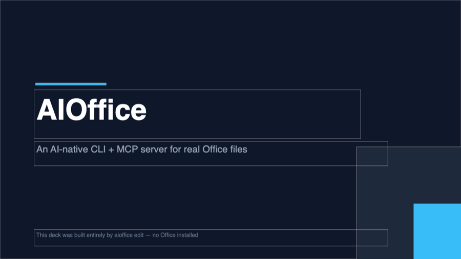
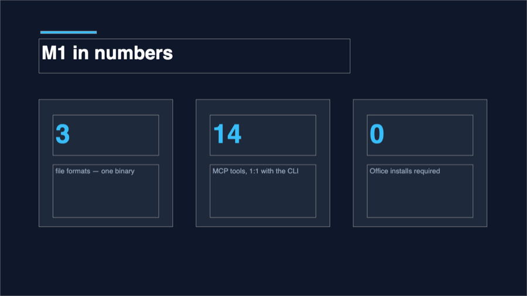
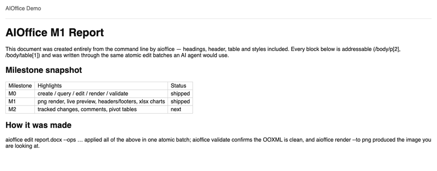
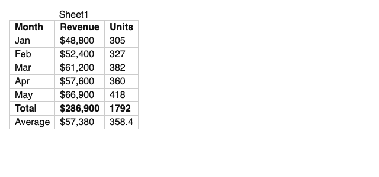
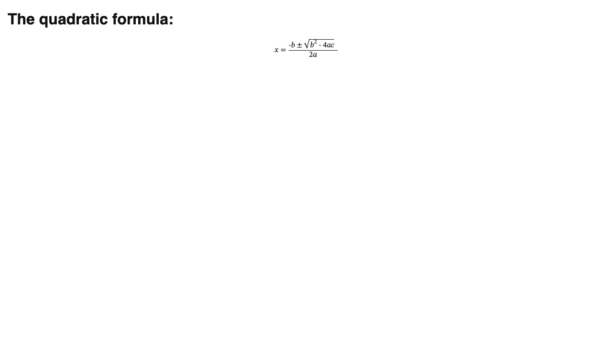

# AIOffice

[English](README.md) | **简体中文**

[](https://github.com/onecer/AIOffice/actions/workflows/ci.yml)
[](LICENSE)


**为 AI agent 而生的 Office CLI + MCP 服务器。** AIOffice 让 agent 像调用函数一样创建、查询、编辑、渲染、预览、校验真实的 `.docx` / `.xlsx` / `.pptx`：一条命令进，恰好一个 JSON 信封出。

100% 自研，纯 C#/.NET 直接无损读写 OOXML（DocumentFormat.OpenXml + ClosedXML）。**一个约 36 MB 的单文件二进制，无需安装 Office，零运行时依赖，不包装任何第三方引擎。**

```bash
aioffice create report.docx --title "Q3 报告"
aioffice edit   report.docx --set '/body/p[1]' text="营收增长 12%"
aioffice read   report.docx --view outline
aioffice mcp    # 同样的 15 项能力，以 MCP 工具形式走 stdio
```

## 眼见为实

下面每个文件都仅由 `aioffice` 创建、编辑、校验并截图——没装 Office，没有模板，没有手工修饰。完整脚本折叠在下方；[deck-1.svg](assets/demo/deck-1.svg) 是同一页标题幻灯片的 SVG 版本，其中每个形状都带有指回规范文档路径的 `data-aio-path` 属性。

| | |
|---|---|
| <br><sub>`aioffice render deck.pptx --to png --scope '/slide[1]' -o deck-1.png`</sub> | <br><sub>`aioffice query deck.pptx 'shape:contains("14")'` → `/slide[2]/shape[@id=9]`</sub> |
| <br><sub>`aioffice get report.docx '/header[1]/p[1]'` → `"text": "AIOffice Demo"`</sub> | <br><sub>`aioffice get metrics.xlsx /Sheet1/B7` → `"cachedValue": 286900`</sub> |

<details>
<summary>完整脚本（逐条原样命令，含 render → look → fix 闭环）</summary>

```bash
# 在一个空目录中，aioffice 已加入 PATH

# ---- deck.pptx —— 3 页幻灯片，深色背景 + 强调色形状 ----
aioffice create deck.pptx
aioffice edit deck.pptx --ops '[
  {"op":"add","path":"/slide[1]","type":"shape","props":{"name":"bg","x":0,"y":0,"w":"33.87cm","h":"19.05cm","fill":"0F172A"}},
  {"op":"add","path":"/slide[1]","type":"shape","props":{"name":"deco-1","x":26.2,"y":10.8,"w":12,"h":12,"fill":"1E293B"}},
  {"op":"add","path":"/slide[1]","type":"shape","props":{"name":"deco-2","x":30.4,"y":15,"w":8,"h":8,"fill":"38BDF8"}},
  {"op":"add","path":"/slide[1]","type":"shape","props":{"name":"accent","x":2.6,"y":6.1,"w":5.2,"h":0.16,"fill":"38BDF8"}},
  {"op":"add","path":"/slide[1]","type":"shape","props":{"text":"AIOffice","x":2.5,"y":6.6,"w":24,"h":3.6,"fontSize":60,"bold":true,"color":"FFFFFF"}},
  {"op":"add","path":"/slide[1]","type":"shape","props":{"text":"An AI-native CLI + MCP server for real Office files","x":2.5,"y":10.4,"w":26,"h":1.8,"fontSize":20,"color":"94A3B8"}},
  {"op":"add","path":"/slide[1]","type":"shape","props":{"text":"This deck was built entirely by aioffice edit — no Office installed","x":2.5,"y":16.9,"w":26,"h":1.2,"fontSize":12,"color":"64748B"}}]'
aioffice edit deck.pptx --ops '[
  {"op":"add","path":"/slide[1]","type":"slide","position":"after"},
  {"op":"add","path":"/slide[2]","type":"shape","props":{"name":"bg","x":0,"y":0,"w":"33.87cm","h":"19.05cm","fill":"0F172A"}},
  {"op":"add","path":"/slide[2]","type":"shape","props":{"name":"accent","x":2.6,"y":2.0,"w":3.6,"h":0.16,"fill":"38BDF8"}},
  {"op":"add","path":"/slide[2]","type":"shape","props":{"text":"M1 in numbers","x":2.5,"y":2.5,"w":20,"h":2.2,"fontSize":34,"bold":true,"color":"FFFFFF"}},
  {"op":"add","path":"/slide[2]","type":"shape","props":{"name":"card-1","x":2.5,"y":6.4,"w":8.6,"h":8.2,"fill":"1E293B"}},
  {"op":"add","path":"/slide[2]","type":"shape","props":{"text":"3","x":3.4,"y":7.4,"w":6.8,"h":2.6,"fontSize":48,"bold":true,"color":"38BDF8"}},
  {"op":"add","path":"/slide[2]","type":"shape","props":{"text":"file formats — docx, xlsx, pptx — one 36 MB binary","x":3.4,"y":10.6,"w":6.8,"h":3.4,"fontSize":13,"color":"94A3B8"}},
  {"op":"add","path":"/slide[2]","type":"shape","props":{"name":"card-2","x":12.6,"y":6.4,"w":8.6,"h":8.2,"fill":"1E293B"}},
  {"op":"add","path":"/slide[2]","type":"shape","props":{"text":"14","x":13.5,"y":7.4,"w":6.8,"h":2.6,"fontSize":48,"bold":true,"color":"38BDF8"}},
  {"op":"add","path":"/slide[2]","type":"shape","props":{"text":"MCP tools, 1:1 with the CLI verbs","x":13.5,"y":10.6,"w":6.8,"h":3.4,"fontSize":13,"color":"94A3B8"}},
  {"op":"add","path":"/slide[2]","type":"shape","props":{"name":"card-3","x":22.7,"y":6.4,"w":8.6,"h":8.2,"fill":"1E293B"}},
  {"op":"add","path":"/slide[2]","type":"shape","props":{"text":"0","x":23.6,"y":7.4,"w":6.8,"h":2.6,"fontSize":48,"bold":true,"color":"38BDF8"}},
  {"op":"add","path":"/slide[2]","type":"shape","props":{"text":"Office installs required — render, preview, validate built in","x":23.6,"y":10.6,"w":6.8,"h":3.4,"fontSize":13,"color":"94A3B8"}}]'
aioffice edit deck.pptx --ops '[
  {"op":"add","path":"/slide[2]","type":"slide","position":"after"},
  {"op":"add","path":"/slide[3]","type":"shape","props":{"name":"bg","x":0,"y":0,"w":"33.87cm","h":"19.05cm","fill":"0F172A"}},
  {"op":"add","path":"/slide[3]","type":"shape","props":{"name":"deco","x":-3,"y":13.5,"w":10,"h":10,"fill":"1E293B"}},
  {"op":"add","path":"/slide[3]","type":"shape","props":{"name":"accent","x":2.6,"y":7.0,"w":5.2,"h":0.16,"fill":"38BDF8"}},
  {"op":"add","path":"/slide[3]","type":"shape","props":{"text":"render → look → fix","x":2.5,"y":7.5,"w":28,"h":3.2,"fontSize":44,"bold":true,"color":"FFFFFF"}},
  {"op":"add","path":"/slide[3]","type":"shape","props":{"text":"One JSON envelope at a time. github.com/onecer/AIOffice","x":2.5,"y":11,"w":26,"h":1.6,"fontSize":18,"color":"94A3B8"}}]'
aioffice validate deck.pptx

# ---- report.docx —— 页眉、Heading1/2、导语、表格 ----
aioffice create report.docx
aioffice edit report.docx --ops '[
  {"op":"add","path":"/header[1]","type":"header","props":{"text":"AIOffice Demo"}},
  {"op":"add","path":"/body","type":"p","position":"inside","props":{"text":"AIOffice M1 Report","style":"Heading1"}},
  {"op":"add","path":"/body","type":"p","position":"inside","props":{"text":"This document was created entirely from the command line by aioffice — headings, header, table and styles included. Every block below is addressable (/body/p[2], /body/table[1]) and was written through the same atomic edit batches an AI agent would use."}},
  {"op":"add","path":"/body","type":"p","position":"inside","props":{"text":"Milestone snapshot","style":"Heading2"}},
  {"op":"add","path":"/body","type":"table","position":"inside","props":{"rows":4,"cols":3}},
  {"op":"set","path":"/body/table[1]/tr[1]/tc[1]","props":{"text":"Milestone"}},
  {"op":"set","path":"/body/table[1]/tr[1]/tc[2]","props":{"text":"Highlights"}},
  {"op":"set","path":"/body/table[1]/tr[1]/tc[3]","props":{"text":"Status"}},
  {"op":"set","path":"/body/table[1]/tr[2]/tc[1]","props":{"text":"M0"}},
  {"op":"set","path":"/body/table[1]/tr[2]/tc[2]","props":{"text":"create / query / edit / render / validate"}},
  {"op":"set","path":"/body/table[1]/tr[2]/tc[3]","props":{"text":"shipped"}},
  {"op":"set","path":"/body/table[1]/tr[3]/tc[1]","props":{"text":"M1"}},
  {"op":"set","path":"/body/table[1]/tr[3]/tc[2]","props":{"text":"png render, live preview, headers/footers, xlsx charts"}},
  {"op":"set","path":"/body/table[1]/tr[3]/tc[3]","props":{"text":"shipped"}},
  {"op":"set","path":"/body/table[1]/tr[4]/tc[1]","props":{"text":"M2"}},
  {"op":"set","path":"/body/table[1]/tr[4]/tc[2]","props":{"text":"tracked changes, comments, pivot tables"}},
  {"op":"set","path":"/body/table[1]/tr[4]/tc[3]","props":{"text":"next"}},
  {"op":"add","path":"/body","type":"p","position":"inside","props":{"text":"How it was made","style":"Heading2"}},
  {"op":"add","path":"/body","type":"p","position":"inside","props":{"text":"aioffice edit report.docx --ops … applied all of the above in one atomic batch; aioffice validate confirms the OOXML is clean, and aioffice render --to png produced the image you are looking at."}}]'
aioffice read report.docx --view outline        # 先看大纲：标题 + 规范路径
aioffice edit report.docx --remove '/body/p[1]' # 删掉 create 留下的空段落
aioffice validate report.docx
aioffice get report.docx '/header[1]/p[1]'      # → "text": "AIOffice Demo"

# ---- metrics.xlsx —— 销售表、SUM/AVERAGE、数字格式、柱状图 ----
aioffice create metrics.xlsx
aioffice edit metrics.xlsx --ops '[
  {"op":"set","path":"/Sheet1/A1","props":{"value":"Month"}},
  {"op":"set","path":"/Sheet1/B1","props":{"value":"Revenue"}},
  {"op":"set","path":"/Sheet1/C1","props":{"value":"Units"}},
  {"op":"set","path":"/Sheet1/A1:C1","props":{"bold":true,"fill":"DBEAFE"}},
  {"op":"set","path":"/Sheet1/A2","props":{"value":"Jan"}},
  {"op":"set","path":"/Sheet1/B2","props":{"value":48800}},
  {"op":"set","path":"/Sheet1/C2","props":{"value":305}},
  {"op":"set","path":"/Sheet1/A3","props":{"value":"Feb"}},
  {"op":"set","path":"/Sheet1/B3","props":{"value":52400}},
  {"op":"set","path":"/Sheet1/C3","props":{"value":327}},
  {"op":"set","path":"/Sheet1/A4","props":{"value":"Mar"}},
  {"op":"set","path":"/Sheet1/B4","props":{"value":61200}},
  {"op":"set","path":"/Sheet1/C4","props":{"value":382}},
  {"op":"set","path":"/Sheet1/A5","props":{"value":"Apr"}},
  {"op":"set","path":"/Sheet1/B5","props":{"value":57600}},
  {"op":"set","path":"/Sheet1/C5","props":{"value":360}},
  {"op":"set","path":"/Sheet1/A6","props":{"value":"May"}},
  {"op":"set","path":"/Sheet1/B6","props":{"value":66900}},
  {"op":"set","path":"/Sheet1/C6","props":{"value":418}},
  {"op":"set","path":"/Sheet1/A7","props":{"value":"Total","bold":true}},
  {"op":"set","path":"/Sheet1/B7","props":{"value":"=SUM(B2:B6)","bold":true}},
  {"op":"set","path":"/Sheet1/C7","props":{"value":"=SUM(C2:C6)","bold":true}},
  {"op":"set","path":"/Sheet1/A8","props":{"value":"Average"}},
  {"op":"set","path":"/Sheet1/B8","props":{"value":"=AVERAGE(B2:B6)"}},
  {"op":"set","path":"/Sheet1/C8","props":{"value":"=AVERAGE(C2:C6)","numberFormat":"0.0"}},
  {"op":"set","path":"/Sheet1/B2:B8","props":{"numberFormat":"$#,##0"}},
  {"op":"add","path":"/Sheet1","type":"chart","props":{"kind":"bar","dataRange":"A1:B6","anchor":"E2","title":"Revenue by month"}}]'
aioffice get metrics.xlsx /Sheet1/B7            # → "formula": "=SUM(B2:B6)", "cachedValue": 286900
aioffice get metrics.xlsx /Sheet1/B8            # → "formula": "=AVERAGE(B2:B6)", "cachedValue": 57380
aioffice get metrics.xlsx '/Sheet1/chart[1]'    # → 柱状图 "Revenue by month"，A1:B6 @ E2
aioffice validate metrics.xlsx

# ---- render：「看」的那一步 ----
aioffice render deck.pptx    --to png --scope '/slide[1]' -o deck-1.png
aioffice render deck.pptx    --to png --scope '/slide[2]' -o deck-2.png
aioffice render deck.pptx    --to svg --scope '/slide[1]' -o deck-1.svg
aioffice render report.docx  --to png -o report.png
aioffice render metrics.xlsx --to png -o metrics.png

# ---- look → fix：第 2 页卡片文字溢出了卡片边界 ----
aioffice query deck.pptx 'shape:contains("formats")'   # 找到标签 → /slide[2]/shape[6]
aioffice edit deck.pptx --ops '[
  {"op":"set","path":"/slide[2]/shape[6]","props":{"text":"file formats — one binary"}},
  {"op":"set","path":"/slide[2]/shape[9]","props":{"text":"MCP tools, 1:1 with the CLI"}},
  {"op":"set","path":"/slide[2]/shape[12]","props":{"text":"Office installs required"}}]'
aioffice validate deck.pptx
aioffice render deck.pptx --to png --scope '/slide[2]' -o deck-2.png
```

PNG 入库 `assets/demo/` 前仅做了等比缩放（≤900 px 宽，sips/Pillow），像素未做其他处理。xlsx 的 PNG 展示的是 HTML 渲染器当前画出的内容：单元格、格式与公式缓存结果；柱状图真实存在于文件中（见 `get '/Sheet1/chart[1]'`），用 Excel 打开即可看到。

</details>

## 为什么是 "AI-Native"？

大多数 office 库为程序员而写，大多数 office CLI 为人类而写。AIOffice 为 **agent** 而写——每个设计决策都在优化 LLM 真实运行的循环：*执行 → 观察 → 恢复 → 验证*。

| 特性 | 对 agent 意味着什么 |
|---|---|
| **每条命令恰好一个 JSON 信封** | stdout 永远是 `{ok, data, error, meta}`，无需解析猜测 |
| **会教学的错误** | 每个错误强制携带 `suggestion`；`invalid_path` 还附带服务端算好的 `candidates`（最近的合法路径）——一次失败，零轮浪费的恢复对话 |
| **稳定寻址** | `/body/p[3]`、`/Sheet1/A1:C10`、`/slide[2]/shape[3]` —— 1 起始、规范化、由 `query` 返回，编辑永远不用猜序号 |
| **原子批量编辑** | `edit --ops '[...]'` 全部成功或全部不落盘；支持 `--dry-run`；乐观并发守卫 `--expect-rev`——文件被外部改动时在**任何写入之前**以 `stale_address` 失败 |
| **自动可撤销** | 每次变更前自动快照前像（20 份环形保留），`snapshot restore` 一次调用即回滚，回滚本身也可撤销 |
| **公式写入即求值** | Excel 公式写入时计算并**把结果缓存进文件**（`=SUM(A1:A2)` → 重新打开直接是 `42`）；引擎算不了的函数显式给 `formula_not_evaluated` 警告——绝不静默留旧值 |
| **render → look → fix 闭环** | docx/xlsx 渲染 HTML、pptx 逐页渲染 SVG，还能经系统浏览器一键出 **PNG**，全程无需 Office——agent 能"看见"自己做的东西再改 |
| **人在环中的实时预览** | `preview open` 在 localhost 起一个实时视图；渲染节点带 `data-aio-path`，人类**点一下**，`preview selection` 就把规范路径还给 agent |
| **默认沙箱** | 所有文件参数在工作区白名单内解析（`--workspace`，含符号链接逃逸检查）；越界即 `sandbox_denied`，退出码 4 |
| **可自省的命令面** | `aioffice schema` 返回整个命令面的机器可读 JSON——agent 读规范，而不是幻觉规范 |
| **CLI = MCP 同一套心智模型** | 15 个 CLI 动词与 15 个 MCP 工具 1:1 对应，学一次，shell 和 stdio 两种接入 |

### "会教学的错误" —— 真实输出

```bash
$ aioffice get report.docx '/body/paragraph[1]'
```
```json
{
  "ok": false,
  "error": {
    "code": "invalid_path",
    "message": "'paragraph' cannot appear under /body (body contains: p, table).",
    "suggestion": "Use a candidate path, or run 'aioffice query <file> \"*\"' to list addressable nodes.",
    "candidates": ["/body/p[1]"]
  },
  "meta": { "file": "report.docx", "rev": "c73500e407fc", "elapsedMs": 143, "version": "0.1.0" }
}
```

### 诚实的公式 —— 真实输出

```bash
$ aioffice edit data.xlsx --ops '[{"op":"set","path":"/Sheet1/B1","props":{"value":"=SEQUENCE(3)"}}]'
```
```json
{
  "ok": true,
  "data": { "applied": 1, "ops": [{ "op": "set", "path": "/Sheet1/B1", "applied": ["formula"] }] },
  "meta": {
    "warnings": [{
      "code": "formula_not_evaluated",
      "message": "1 formula cell(s) use functions the built-in engine cannot evaluate: /Sheet1/B1. The formula text is saved without a cached value; Excel computes it when the file opens."
    }]
  }
}
```

## 快速开始

```bash
# 构建（需 .NET 10 SDK）
dotnet build AIOffice.sln

# 源码运行
alias aioffice='dotnet run --project src/AIOffice.Cli --'

# 或发布单文件二进制（约 36 MB，自包含）
dotnet publish src/AIOffice.Cli -r osx-arm64 -c Release \
  -p:PublishSingleFile=true --self-contained
# rid 可选：osx-arm64 | osx-x64 | win-x64 | win-arm64 | linux-x64 | linux-arm64

aioffice doctor          # 环境 / 处理器 / 工作区体检
```

### 60 秒上手

```bash
# Word
aioffice create report.docx --title "Q3 报告"
aioffice edit   report.docx --ops '[
  {"op":"add","path":"/body","type":"p","position":"inside",
   "props":{"text":"季度业绩","style":"Heading1"}}]'
aioffice query  report.docx 'p[style=Heading1]'      # → 规范路径 + 文本片段
aioffice render report.docx --to html -o report.html

# Excel —— 公式写入即求值
aioffice create data.xlsx
aioffice edit   data.xlsx --ops '[
  {"op":"set","path":"/Sheet1/A1","props":{"value":21}},
  {"op":"set","path":"/Sheet1/A2","props":{"value":21}},
  {"op":"set","path":"/Sheet1/A3","props":{"value":"=SUM(A1:A2)"}}]'
aioffice get data.xlsx /Sheet1/A3                    # → "cachedValue": 42

# PowerPoint —— 看见自己做的东西
aioffice create deck.pptx          # 新建即自带 1 页空白幻灯片
aioffice edit   deck.pptx --ops '[{"op":"add","path":"/slide[1]","type":"slide",
                                   "position":"after","props":{"title":"Hello"}}]'
aioffice edit   deck.pptx --add '/slide[1]' --type shape text="AIOffice" x=2cm y=3cm w=10cm h=2cm
aioffice render deck.pptx --to svg --scope '/slide[1]' -o slide1.svg

# 安全网
aioffice snapshot list report.docx                   # 编辑前自动快照
aioffice snapshot restore report.docx 1              # 一次调用回滚
aioffice validate report.docx                        # OOXML 校验 + lint
```

## Markdown 进，Office 出

Agent 用 markdown 和 csv 思考。M5（v0.6.0）把它们变成正门——下面每条命令都原样来自发版冒烟：

```bash
# markdown -> 真 docx（标题、嵌套列表、管道表格、链接、加粗、代码）
aioffice create report.docx --from notes.md
aioffice read   report.docx --view outline     # 标题 + 规范路径
aioffice read   report.docx --view markdown    # ……再以 GFM 导出——结构 round-trip
aioffice validate report.docx                  # "valid": true，0 错误

# csv -> 类型化 xlsx（带引号的逗号值不丢，日期成日期，"007" 保持文本）
aioffice create orders.xlsx --from orders.csv
aioffice get    orders.xlsx /Sheet1/A2         # → "value": "007", "type": "text"
aioffice read   orders.xlsx --view csv         # 单 sheet 以 RFC 4180 csv 导出
```

源/目标不匹配会快速失败，suggestion 给出矩阵：`.md/.markdown → .docx，.csv/.tsv → .xlsx`。MCP 同一套接线：`office_create {file, from}` 与 `office_read {view:"markdown"|"csv"}`。

## LaTeX 进，公式出

M6（v0.7.0）新增了一个手写的 LaTeX → OOXML Math 转换器（无 LaTeX 依赖）。你写 LaTeX，文档里得到**真正的 Office Math**，Word 当作公式渲染。下面每条命令都原样来自发版冒烟：

```bash
# 新建文档，加行内公式 + 显示块（二次求根公式）+ 矩阵
aioffice create report.docx --title "M6 Report"
aioffice edit report.docx --ops '[{"op":"add","path":"/body/p[1]","type":"equation","props":{"latex":"E = mc^2"}}]'
aioffice edit report.docx --ops '[{"op":"add","path":"/body/p[1]","type":"equation","props":{"latex":"\\frac{-b \\pm \\sqrt{b^2-4ac}}{2a}","display":true}}]'
aioffice edit report.docx --ops '[{"op":"add","path":"/body/p[1]","type":"equation","props":{"latex":"\\begin{pmatrix}1&0\\\\0&1\\end{pmatrix}","display":true}}]'

aioffice read report.docx --view text     # → "M6 Report$E = mc^2$"、"$$\frac{-b \pm \sqrt{b^2-4ac}}{2a}$$"、…
aioffice get  report.docx /body/p[1]/omath[1]   # → "latex": "E = mc^2", "display": false
aioffice validate report.docx              # "valid": true，0 错误

# 未知命令降级——文件仍校验通过，只是给一个警告
aioffice edit report.docx --ops '[{"op":"add","path":"/body/p[4]","type":"equation","props":{"latex":"\\foobar{x} + \\alpha"}}]'
# → ok:true + meta.warnings: [{ "code": "equation_partial", "message": "…\\foobar… appear literally…" }]
```

原始 LaTeX 以 `mc:Ignorable` 厂商属性存档在每个公式上，所以 `get` 原样返回你的源、round-trip 字节忠实。支持的子集——分式、根式、上下标、大型算符、矩阵（`pmatrix`/`bmatrix`/…）、`\left…\right`、重音、`\text`、希腊字母与算符——见 `aioffice help equations`。渲染出来公式是真的：

```bash
aioffice render report.docx --to png -o quadratic.png   # 下图正是这样产出的
```



## 交付前先审计

`aioffice audit` 是 Office 文件的无障碍 + 质量 lint。findings 是**数据**，不是错误——即使报出 error 级 finding，命令也返回 `0`，与 `validate` 完全一致。`--fix` 只应用**安全、非破坏性**的自动修复，并重审，让你看清还剩什么。

```bash
# 一个故意做坏的报告：图片无 alt、H1 后直接 H3、表格没有表头、空标题、没有文档标题。
$ aioffice audit report.docx
{ "ok": true, "data": {
  "findings": [
    { "code": "a11y_no_doc_title",   "severity": "warning", "path": "/properties",      "autofixable": true  },
    { "code": "a11y_no_alt_text",     "severity": "error",   "path": "/body/p[5]",        "autofixable": true  },
    { "code": "a11y_heading_skip",    "severity": "warning", "path": "/body/p[3]",        "autofixable": false },
    { "code": "quality_empty_heading","severity": "warning", "path": "/body/p[4]",        "autofixable": false },
    { "code": "a11y_no_table_header", "severity": "error",   "path": "/body/table[1]",    "autofixable": true  }
  ],
  "summary": { "errors": 2, "warnings": 3, "infos": 0 } } }

# --fix 应用安全自动修复（alt 文本、表头行、文档标题），再重审。标题跳级与空标题是
# 「仅报告」类 finding，会留在 remaining 里等你手工处理。
$ aioffice audit report.docx --fix
{ "ok": true, "data": {
  "findings": [
    { "code": "a11y_heading_skip",     "path": "/body/p[3]", "autofixable": false },
    { "code": "quality_empty_heading", "path": "/body/p[4]", "autofixable": false }
  ],
  "summary": { "errors": 0, "warnings": 2, "infos": 0 },
  "fixed": 3,
  "remaining": ["a11y_heading_skip#/body/p[3]", "quality_empty_heading#/body/p[4]"] } }

# 修复后仍是合法 OOXML。
$ aioffice validate report.docx
{ "ok": true, "data": { "valid": true, "count": 0, "issues": [] } }
```

同一个动词、同一套 findings、同一份 `--fix` 语义也覆盖 **.xlsx**（`#DIV/0!` 等公式错误、合并数据单元格、缺 alt 文本/标题）与 **.pptx**（图片 alt 文本、幻灯片标题、画布外形状、过小字号、阅读顺序）。用 `--category accessibility|quality|all` 与 `--severity error|warning|info` 限定范围；完整 code 清单与哪些可自动修复见 `aioffice help audit`。走 MCP 即 `office_audit {file, category?, severity?, fix?}`——第 15 个工具。

## MCP（接入 Claude 等 agent）

```bash
aioffice mcp     # stdio MCP 服务器 —— 15 个工具，与 CLI 动词 1:1
```

Claude Desktop / Claude Code 配置：

```json
{
  "mcpServers": {
    "aioffice": {
      "command": "aioffice",
      "args": ["mcp", "--workspace", "/path/to/your/documents"]
    }
  }
}
```

| MCP 工具 | CLI 动词 | MCP 工具 | CLI 动词 |
|---|---|---|---|
| `office_create` | create | `office_validate` | validate |
| `office_read` | read | `office_template` | template |
| `office_query` | query | `file_snapshot` | snapshot |
| `office_get` | get | `office_status` | doctor |
| `office_edit` | edit | `office_help` | help |
| `office_render` | render | `office_schema` | schema |
| `office_audit` | audit | `preview_open` | preview open |
| `preview_selection` | preview selection | | |

`preview_open` / `preview_selection`（实时预览 + 人工点选回读）已于 M1（v0.2.0）注册；`office_audit`（无障碍 + 质量 lint）是第 15 个工具，M7（v0.8.0）加入。全部工具 schema 的 token 预算上限 3,500——由测试强制，加入 `office_audit` 后仍在预算内。

## 命令面（v0.8.0）

| 动词 | 说明 |
|---|---|
| `create <file> [--from notes.md\|data.csv] [--kind] [--title]` | 新建文档（类型按扩展名推断）——或**导入**：`.md` → `.docx`、`.csv` → `.xlsx` |
| `read <file> [--view outline\|text\|stats\|structure\|markdown\|csv]` | 低成本巡检投影，可分页；`markdown` 把 docx body 导出为 GFM，`csv` 导出单个 xlsx sheet（`--sheet`、`--range`） |
| `query <file> <selector>` | CSS 风格选择器 → 规范路径（`p[style=Heading1]`、`cell[value>100]`、`shape:contains('Q3')`） |
| `get <file> <path>` | 取单个节点及属性 |
| `edit <file> --ops <json\|@file>` | **原子**批量 set/add/remove/move/replace · `--dry-run` · `--expect-rev` · 语法糖 `--set/--add/--remove` · **文档级查找替换糖** `--find X --replace Y [--regex] [--match-case] [--whole-word]`（docx 正文+全部页眉页脚、每个 sheet、每页 slide 含备注；聚合返回 `{replacements, locations}`；docx 配 `--track` 时逐命中生成修订对） |
| `render <file> [--to html\|svg\|text\|png\|pdf] [--scope]` | "看"的那一步——docx/xlsx 出 html，pptx 逐页出 svg，**png/pdf** 经系统浏览器输出（pptx pdf：整副 deck，一页一张幻灯片） |
| `validate <file>` | OOXML 校验 + lint，带修复建议 |
| `audit <file> [--category accessibility\|quality\|all] [--severity error\|warning\|info] [--fix]` | **无障碍 + 质量 lint**——findings 是数据（`ok:true`，exit 0）；`--fix` 只做安全自动修复（alt 文本、表头行、文档/幻灯片标题、孤儿书签）并返回 `{fixed, remaining}` |
| `template <file> --data <json\|@file>` | `{{key}}` 模板合并（跨 run 拆分安全） |
| `snapshot <list\|restore> <file> [n]` | 编辑前快照环（20 份） |
| `preview <open\|selection\|close> <file> [--port N]` | localhost 实时预览；人点选 → `selection` 返回规范路径 |
| `doctor` | 环境 / 运行时 / 处理器诊断 |
| `schema [verb]` | 整个命令面的机器可读 JSON |
| `help [topic]` | addressing · selectors · properties-docx/xlsx/pptx · errors · **equations** · **rtl** · **sections** · **audit** |
| `mcp` | stdio MCP 服务器 |
| `version` | 版本信息 |

全局参数：`--json`（非 TTY 默认）· `--pretty` · `--workspace <dir>`（沙箱根，默认 cwd，亦可 `AIOFFICE_WORKSPACE`）· `--quiet`。
退出码：`0` 成功 · `2` 用户错误 · `3` 内部/格式错误 · `4` sandbox_denied · `5` unsupported_feature。

**寻址语法**（1 起始）：`/body/p[3]` · `/body/table[1]/tr[2]/tc[1]` · `/body/p[3]/omath[1]` · `/Sheet1/A1:C10` · `/Sheet1/table[@name=Sales]` · `/Sheet1/row[2]:row[6]` · `/'Q3 Data'/B2` · `/slide[2]/shape[3]` · `/section[1]` · `/master[1]/layout[2]` · `/`（pptx 幻灯片尺寸 + 分节）· **M7**：`/properties`（文档 core + custom 属性）· `/sdt[@tag=status]`（docx 内容控件）· `/style[@name=Currency-Red]`（xlsx 命名单元格样式）。

## 当前能力（M0 + M1 + M2 + M3 + M4 + M5 + M6 + M7）

| 格式 | M0（v0.1.0） | + M1（v0.2.0） | + M2（v0.3.0） | + M3（v0.4.0） | + M4（v0.5.0） | + M5（v0.6.0） | + M6（v0.7.0） | + M7（v0.8.0） |
|---|---|---|---|---|---|---|---|---|
| **.docx** | 创建 · 段落/标题/样式 · 表格 · 文本与格式编辑（加粗/斜体/颜色/对齐/字号）· query/get · outline/text/stats/structure 视图 · HTML 渲染 · `{{key}}` 模板 · 校验 | **页眉/页脚**（创建 + 编辑，`/header[1]/p[1]`）· PNG 渲染 · 实时预览 | **修订**（`--track --author`，`read --view revisions`，按 `/revision[@id=N]` 或范围 accept/reject）· **批注**（增/读/删，`/comment[@id=N]`）· **自定义样式**（`/styles` add，`/style[@id=X]` set/get/remove）· **图片**（PNG/JPEG，src 必经沙箱，缺省守纵横比） | **列表**（编号/项目符号，多级嵌套与重新编号；text 视图带 `1.`/`•` 标记，HTML 渲染输出真 `<ol>/<ul>`）· **超链接**（外链 + 书签锚点）· **书签** · **脚注** · **页面设置**（`/section[1]`：纸张/方向/边距）· **格式修订 accept/reject**（w:rPrChange/w:pPrChange）· **批注线程回复**（在 `/comment[@id=N]` 上 `add type:reply`） | **目录 TOC**（`add type:toc`，levels/title/position；`/toc[1]` get 回报 entryCount）· **文本水印**（`add type:watermark`，写入每个页眉，无页眉自动建）· **尾注**（`/endnote[@id=N]`）· **分节符**（`add type:sectionBreak`，逐节独立页面设置——同一文件横竖混排）· **查找替换**（跨 run 匹配；`--track` 时逐命中生成 w:del+w:ins 修订对） | **markdown 桥**（`create --from notes.md` 导入 GFM——标题/列表/表格/链接/代码；`read --view markdown` 导出回去，结构 round-trip）· **深表格**（`mergeRight`/`mergeDown`、边框 all/outer/none、底纹、`headerRow` 跨页重复、`columnWidths`、valign；HTML 渲染出真 colspan/rowspan）· **域**（PAGE/NUMPAGES/DATE/TITLE + `leadingText`——「Page X of Y」页脚）· **首页/奇偶页眉页脚变体**（`/header[firstPage]`，自动接线 `w:titlePg`/`w:evenAndOddHeaders`） | **公式**（`add type:equation`——LaTeX → 真 Office Math；行内 `/body/p[i]/omath[j]` 或显示块；text 视图出 `$…$`/`$$…$$`；未知命令降级 + `equation_partial` 警告；原始 LaTeX 存档可忠实回读）· **右到左/双向**（段落 `w:bidi` / run `w:rtl` / 表格 `w:bidiVisual` 的 `rtl` prop）· **多栏分节**（`/section[1]` 的 `columns`/`columnGap` + `add type:columnBreak`） | **审计**（`audit report.docx [--fix]`——无 alt 文本、标题跳级、表头行缺失、低对比度、无文档标题、空/坏标题、坏链接、孤儿书签；alt/表头/标题/书签可安全自动修复）· **文档属性**（`set /properties` core + 类型化 custom；`read --view properties`）· **内容控件**（`add type:contentControl` text/dropdown/date/checkbox；`/sdt[@tag=X]`；`read --view fields`）· **图片 alt 文本**（`set {alt}`） |
| **.xlsx** | 创建 · 类型化写入（数字/布尔/字符串/日期）· **公式求值并缓存结果** + 诚实警告 · 数字格式 · 合并单元格 · 表格/工作表 · 区域读取 · 按值/公式查询 · HTML 渲染 · 模板 · 校验 | **图表**（bar/line/pie，`add type:chart`）· PNG 渲染 · 实时预览 | **数据透视表**（rows/columns/filters + sum/average/count/min/max，`pivot[@name=X]` 寻址）· **条件格式**（cellIs/colorScale/dataBar/containsText）· **图片**（anchor 锚定，PNG/JPEG） | **大工作簿流式读取**（SAX 扫原始 XML——`read --view stats/text` 与单元格/区域 `get` 不加载 DOM；41 MB / 33 万行约 2 秒出 stats）· **散点图与面积图** · **命名区域**（`/name[@name=X]`，公式可用——`=SUM(SalesData)` 真求值）· **冻结窗格** · **自动筛选** · **打印设置**（方向/纸张/fitTo/打印区域） | **批量 2D 写入**（锚点式 `set /Sheet1/A2 values:[[…]]` 或精确区域式；公式随写随求值；>50k 单元格写空白 sheet 走 SAX 流式）· **行列操作**（插删自动重写公式引用、行高列宽、隐藏、`col[C]` 字母寻址）· **单元格批注**（增/读/删 + 作者）· **查找替换**（文本单元格；`inFormulas:true` 才进公式文本） | **csv 桥**（`create --from orders.csv`：RFC 4180、分隔符嗅探、类型化单元格——`007` 保持文本，>50k 单元格走流式；`read --view csv [--sheet] [--range]` 反向导出）· **数据验证**（list 下拉，字面值或引用区域；wholeNumber/decimal/date/textLength 规则 + 算子；错误样式）· **迷你图**（line/column/winLoss，颜色、markers）· **线程批注**（真 `xl/threadedComments` + 按 `/Sheet1/comment[@id=GUID]` 回复，旧客户端 note 退化）· **单元格超链接**（`https://…` 外链 + `#Sheet!A1` 内链，tooltip） | **就地流式写入**（`stream:true` 或任意 >20 MB 文件经 SAX writer 原地改写工作簿——50 MB+ 大表里写深单元格、批量写区域秒级完成；结果标 `streamed:true`）· **Excel 表 / ListObject**（`add type:table` 套区域——命名、内置样式、汇总行 sum/avg/…、结构化引用 `=SUM(Sales[Amount])` 求值；`/Sheet1/table[@name=X]`）· **大纲分组**（`add type:group` 套 `row[a]:row[b]` / `col[a]:col[b]` 跨段、`collapsed`、嵌套级别） | **审计**（`audit metrics.xlsx [--fix]`——公式错误 `#DIV/0!`/`#REF!`、合并数据单元格、图片无 alt、无文档标题；alt/标题可安全自动修复）· **命名单元格样式**（`add type:cellStyle` numberFormat/bold/fill/color/border 一次定义，`set {cellStyle:"X"}` 套区域，`read --view styles`，`/style[@name=X]`）· **文档属性**（`set /properties`；`read --view properties`）· **图片 alt 文本** |
| **.pptx** | 创建（validator 零错误，PowerPoint/Keynote 可直接打开）· 增/删/重排幻灯片 · 定位文本形状（cm/EMU）· 稳定 shape id 的 query/get · **逐页 SVG 渲染** · 模板 · 校验 | 形状**填充/字体/颜色/对齐属性** · **母版/版式只读寻址** · 逐页 PNG 渲染 · 实时预览 | **幻灯片背景**（真 `p:bg` 纯色填充）· **演讲者备注**（`/slide[i]/notes` set/add/remove/get）· **图片**（PNG/JPEG，稳定 `shape[@id=N]` 路径） | **原生图表**（bar/line/pie，字面量数据缓存，`/slide[i]/chart[k]`）· **跨文档 `dataFrom`**（图表系列直接取自工作簿）· **切换动画**（fade/push/wipe + 时长）· **预设几何形状**（椭圆/三角/菱形/箭头/圆角矩形 + line 连接线，支持翻转）· **z 序**（`move` 到 front/back/forward/backward） | **可编辑图表数据**（新建图表嵌入真实工作簿——PowerPoint 右键「编辑数据」直接可用；旧图表 `set {embedData:true}` 一键改造）· **进入动画**（appear/fade/flyIn/wipe，方向与 click/with/after 触发，`/slide[i]/animation[k]`）· **幻灯片批注**（`add type:comment`，`/slide[i]/comment[@id=N]`）· **查找替换**（slide 作用域含演讲者备注） | **原生表格**（`add type:table` rows×cols、`headerRow`、light/medium/dark 三档样式、单元格 `mergeRight`/`mergeDown`、`/slide[i]/table[k]/tr[r]/tc[c]` 寻址、SVG 画出真网格）· **强调与退出动画**（pulse/grow/spin/colorPulse · fadeOut/flyOut/wipeOut，structure 视图按播放顺序列出）· **批注回复**（`add type:reply`——p15 线程，PowerPoint 2013+ 显示）· **SmartArt 读取**（`/slide[i]/smartart[k]` 嵌套节点树；编辑保持类型化 `unsupported_feature`） | **母版与版式编辑**（`set /master[m]` 背景 + 主题强调色、`add type:layout` 克隆版式、编辑母版/版式形状、克隆版式经 `add type:slide props:{layout:N}` 套用）· **幻灯片分节**（`/` 上 `add type:section`，`afterSlide` 区间；`read --view outline` 按节分组；抗重排）· **幻灯片尺寸/宽高比**（`set / {slideSize:"4:3"}` 或显式 `width`/`height`）· **动画时间轴重排**（`move /slide[i]/animation[2] before …`） | **审计**（`audit deck.pptx [--fix]`——图片无 alt、幻灯片无标题、画布外形状、过小字号（<12pt 警告 / <8pt 错误）、阅读顺序；alt/标题可安全自动修复）· **显式 alt 文本/标题**（shape `set {altText}`/`{altTitle}`；SVG 渲染出 `<title>`）· **文档属性**（`set /properties`） |

M3 跨格式新增（功能第一）：

- **`render --to pdf`** —— docx/xlsx 打印为分页 PDF；pptx 整副 deck 出一个 PDF、**一页一张幻灯片**，复用与 PNG 相同的系统浏览器管线（无浏览器时返回类型化 `unsupported_feature` + workaround）。
- **跨文档 `dataFrom`** —— `{"op":"add","type":"chart","props":{"dataFrom":"metrics.xlsx!Sheet1/A1:B5"}}` 直接用工作簿活数据建 pptx 图表：首列 → 分类，表头行 → 系列名，其余列 → 系列值。必经沙箱解析，区域写错时返回 candidates，CLI 与 MCP 行为一致。
- **大小上限改为 opt-in** —— M2 的 50 MB 默认值取消；默认任意大小都能打开（超大 xlsx 读取走流式路径）。设 `AIOFFICE_MAX_FILE_MB` 可恢复硬性 `file_too_large` 上限；未设时 `doctor` 报告 `limits.maxFileMb: "unlimited"`。

M4 跨格式新增 —— **三格式共用一份查找替换契约**：

- `{"op":"replace","path":"<scope>","props":{"find","replace","regex?","matchCase?","wholeWord?"}}` 作用于任意容器路径；路径 `"/"` 表示整份文档（docx 正文 + 全部页眉页脚、每个 sheet、每页 slide 含备注），逐作用域结果聚合为一份 `{replacements, locations}`。
- 跨格式 run 拆分安全（docx/pptx 中被格式切碎的文本照样命中，重写保留首个受影响 run 的格式）；regex 为 .NET 语法 + 2 秒匹配预算（超时 → 类型化 `invalid_args`）；零命中是 `ok:true` + `find_no_match` warning——绝不是错误。
- CLI 糖：`aioffice edit report.docx --find 2025 --replace 2026 [--regex] [--match-case] [--whole-word]`；MCP `office_edit` 行为一致。docx 配 `--track` 时每处替换记成 `w:del`+`w:ins` 修订对，可后续 accept/reject。

长期能力对齐台账（对标业界最强 CLI）见 [docs/PARITY.md](docs/PARITY.md)——能力对齐是北极星，命令面刻意自研。

## 架构

```
                 ┌─────────────────────────────────────────────┐
   agent/human → │  src/AIOffice.Cli   （aioffice，15 动词）    │
   MCP client  → │  src/AIOffice.Mcp   （stdio，15 工具，1:1）  │
                 ├─────────────────────────────────────────────┤
                 │  src/AIOffice.Render （经浏览器出 png/pdf）  │
                 │  src/AIOffice.Preview  （实时点选预览）      │
                 └──────────────┬──────────────────────────────┘
                                │ 信封 · 寻址 · 选择器
                 ┌──────────────▼──────────────────────────────┐
                 │  src/AIOffice.Core                          │
                 │  envelope/errors · DocPath · Selector       │
                 │  Workspace 沙箱 · SnapshotStore · rev       │
                 └───────┬──────────────┬──────────────┬───────┘
                         │              │              │
                 ┌───────▼─────┐ ┌──────▼───────┐ ┌────▼────────┐
                 │AIOffice.Word│ │AIOffice.Excel│ │AIOffice.Pptx│
                 │ OpenXml SDK │ │  ClosedXML   │ │ OpenXml SDK │
                 └───────┬─────┘ └──────┬───────┘ └────┬────────┘
                         ▼              ▼              ▼
                       .docx          .xlsx          .pptx    （无损 OOXML）
```

## 质量

本项目的起点之一，是研究过一个**零自动化测试**却日更发布的优秀 office CLI——AIOffice 选择完全相反的立场：

- **1366 个测试**横跨 7 个项目（Core 124 · Word 424 · Excel 335 · Pptx 365 · MCP 63 · Preview 24 · Render 31），每次提交全绿。
- **往返定律**：打开 → 不编辑直接保存，所有 zip part 必须字节级一致；已文档化的例外被逐一精确断言。
- **独立裁判**：每个变更测试后 OpenXmlValidator 必须报 0 错误——工具不给自己的作业打分。
- **CI 矩阵**：macOS 14 + Windows，warnings-as-errors 构建、金样脚本、单文件发布并冒烟。
- **发版自动化**：推送 `v*` tag 即构建、全量测试、发布 6 平台单文件二进制 + `SHA256SUMS`，并用 `scripts/release-notes-template.md` 渲染的说明创建 GitHub release（打 tag 前先改模板）——见 `.github/workflows/release.yml`。
- **真人核验**：`fixtures/manual-check/` 中的生成文件供真实 Office 打开验证。

## 路线图

- **M0** —— 以上全部；单文件发布；macOS + Windows CI。
- **M1（已交付，v0.2.0）** —— PNG 渲染（探测系统浏览器）· `preview_open`/`preview_selection`（实时预览 + 人工点选回读）· docx 页眉页脚 · pptx 母版/版式只读寻址 · xlsx 图表（bar/line/pie）。
- **M2（已交付，v0.3.0）** —— 修订（`--track`/`--author`，accept/reject）· 批注 · 样式管理 · 数据透视表 · 条件格式 · 图片（三格式）· pptx 背景与演讲者备注 · 大文件守卫（`file_too_large`，`AIOFFICE_MAX_FILE_MB`）。大文件**流式**没有按 M2 交付：它需要一轮专门的基准驱动打磨，M2 以尺寸守卫兜底——移入 M3。
- **M3（已交付，v0.4.0）** —— 功能第一：docx 列表/超链接/书签/脚注/页面设置/格式修订处理/批注回复 · xlsx 流式读取（SAX）/散点+面积图/命名区域/冻结窗格/自动筛选/打印设置 · pptx 原生图表/切换动画/预设几何/z 序 · 跨文档 `dataFrom`（xlsx 数据 → pptx 图表，CLI 与 MCP 同路径）· `render --to pdf`（docx/xlsx 分页；pptx 一页一片）· 大小上限改 opt-in（默认不限）。
- **M4（已交付，v0.5.0）** —— 三格式共用一份**查找替换**契约（跨 run 安全、regex 带超时、文档级 `"/"` 作用域、CLI `--find/--replace` 糖、docx 修订对）· docx **目录/水印/尾注/分节符** · xlsx **批量 2D 写入**（空白 sheet SAX 流式）/**行列操作**/**单元格批注** · pptx **可编辑图表数据**（嵌入工作簿，PowerPoint「编辑数据」可用，`embedData:true` 改造）/**进入动画**/**幻灯片批注** · tag 触发的**发版自动化**。
- **M5（已交付，v0.6.0）** —— **markdown/csv 桥**：`create --from`（`.md` → `.docx` 经 Markdig，`.csv` → `.xlsx` 类型化导入）+ `read --view markdown|csv` 导出 round-trip · docx **深表格**（合并/边框/底纹/columnWidths/headerRow）/**域**（PAGE/NUMPAGES/DATE/TITLE）/**首页与奇偶页眉页脚变体** · xlsx **数据验证**（下拉 + 规则）/**迷你图**/**线程批注 + 回复**/**单元格超链接** · pptx **原生表格**（合并 + 样式）/**强调与退出动画**/**批注回复**/**SmartArt 读取** · `IFormatHandler.CreateFrom` 导入钩子（增量式，默认 `unsupported_feature`）。
- **M6（已交付，v0.7.0）** —— **深水区攻坚**：docx **公式**（手写 LaTeX → Office Math 转换器，行内/显示、矩阵、部分降级警告、原始 LaTeX 存档可忠实回读）/**右到左与双向**（段/run/表）/**多栏分节**（含分栏符）· xlsx **就地流式写入**（经 SAX writer 原地改写 50 MB+ 大工作簿）/**Excel 表**（ListObject + 汇总 + 结构化引用）/**大纲分组**（行/列跨段）· pptx **母版与版式编辑**（背景、主题强调色、克隆版式）/**幻灯片分节**/**幻灯片尺寸与宽高比**/**动画时间轴重排** · 新增寻址形式 `/`（演示文稿根）、`/body/p[i]/omath[j]`、`/section[i]`、`row[a]:row[b]` 跨段、可编辑 `/master[1]/layout[i]`。
- **M7（已交付，v0.8.0）** —— **交付前先审计**：三格式共享 `audit` 动词 + `office_audit` MCP 工具（第 15 个工具）—— 无障碍 + 质量 lint，findings 是数据（`ok:true`，exit 0），`--fix` 只做安全自动修复（占位 alt 文本、表头行、文档/幻灯片标题、孤儿书签）并返回 `{fixed, remaining}` · docx **文档属性**（core + 类型化 custom）/**内容控件**（text/dropdown/date/checkbox，`read --view fields`）/图片 alt 文本 · xlsx **命名单元格样式**（`add type:cellStyle`，`read --view styles`）/文档属性/公式错误 + 合并数据单元格 + alt 文本审计 · pptx alt-text/标题/阅读顺序审计 + 显式 `altText`/`altTitle`/文档属性 · 新增寻址形式 `/properties`、`/sdt[@tag=X]`、`/style[@name=X]`；`office_read` view 枚举新增 `properties`/`fields`/`styles`。
- **M8（种子）** —— pptx/xlsx 公式（幻灯片与单元格内的 OMML，复用 `AIOffice.Word.Equations` 转换器）· 语义 diff 动词 · 跨格式转换（docx ↔ pptx）· OLE 对象 · 插件机制（外部格式 handler）· 动画预设++（完整强调/退出全集、效果链、motion path）· 现代 xlsx 批注打磨 · xlsx/pptx RTL。

## 设计声明

AIOffice 的命令面与现有 office CLI **刻意不兼容**：能力对齐是目标，但动词、参数、寻址语法全部为 agent 从零设计——更小、更可预测、可自省。一套心智模型，两种接入方式（CLI 与 MCP）。

## 文档

[docs/DESIGN.md](docs/DESIGN.md) —— 架构与命令面规范 · [docs/MCP.md](docs/MCP.md) —— MCP 工具规范 · [docs/PARITY.md](docs/PARITY.md) —— 能力对齐台账 · `aioffice help <topic>` —— 内置渐进式文档 · [SMOKE_REPORT.md](SMOKE_REPORT.md) —— 端到端真实验证记录

## License

[Apache-2.0](LICENSE)。见 [THIRD-PARTY-NOTICES.md](THIRD-PARTY-NOTICES.md)——全部依赖均为宽松许可（MIT：DocumentFormat.OpenXml、ClosedXML、ModelContextProtocol C# SDK；BSD-2-Clause：Markdig），无捆绑第三方二进制。
