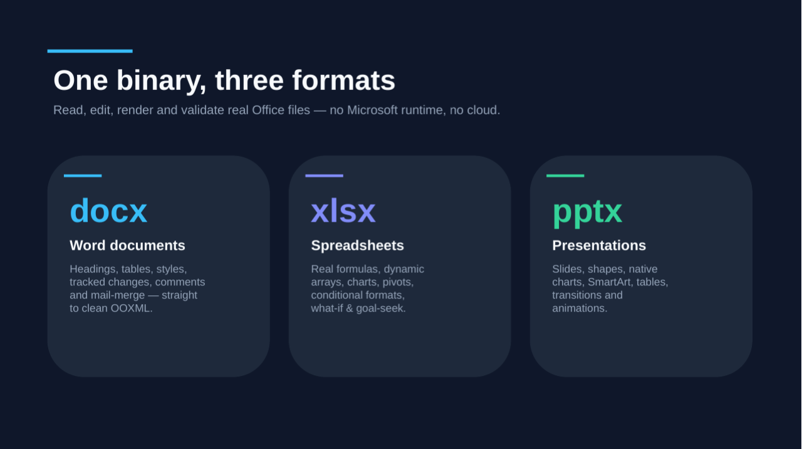
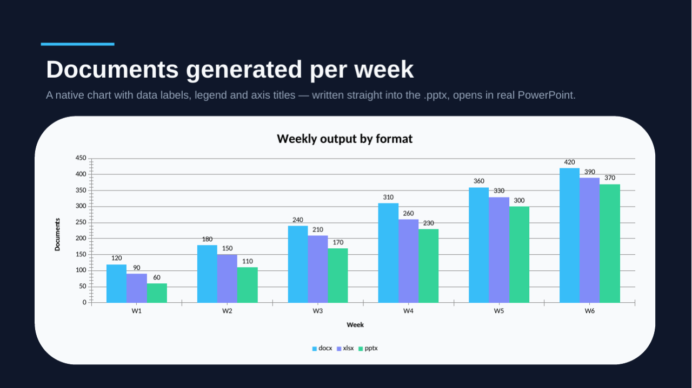
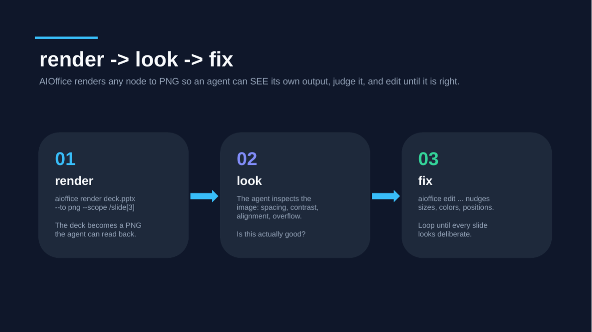
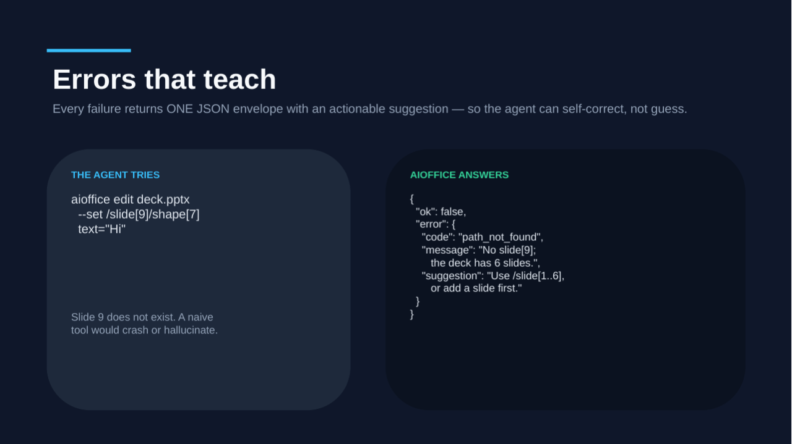
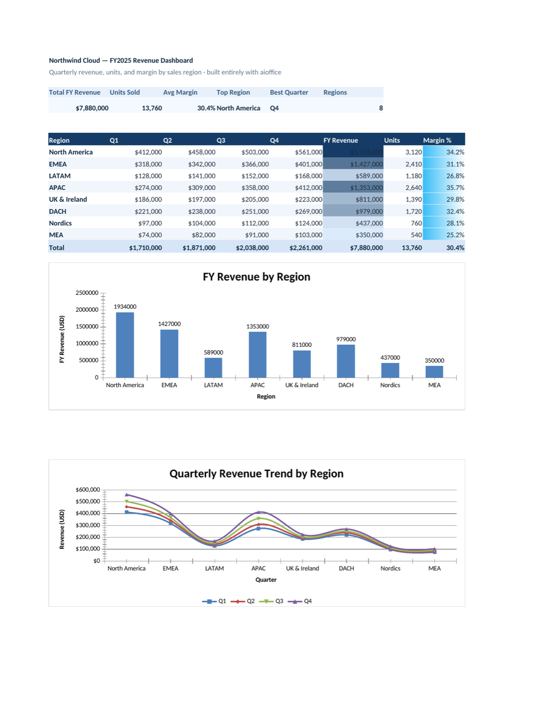
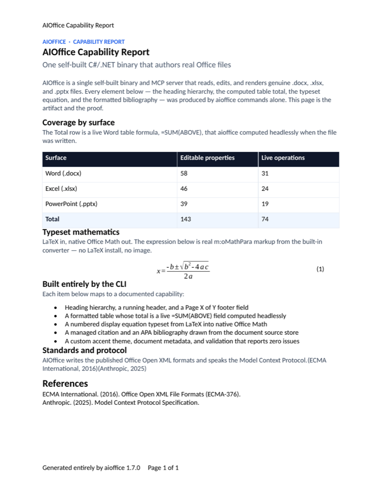

# AIOffice Showcase

**English** | [简体中文](#中文)

Three real Office files (`.pptx`, `.xlsx`, `.docx`), built command by command by
[`aioffice`](README.md) alone — **no Microsoft Office installed, no templates, no
manual touch-ups**. The screenshots below are those exact files opened in
**LibreOffice**: independent, third-party proof that `aioffice` writes genuine,
valid OOXML that any Office app renders faithfully. Each card shows the rendered
output, what it is, how many commands made it, and — behind a fold — the
**verbatim** command sequence. Re-create the whole gallery yourself with one
script: [`examples/tour.sh`](examples/tour.sh).

> The source files (`assets/showcase/deck.pptx`, `dashboard.xlsx`,
> `report.docx`) are committed right next to these PNGs. Open them in PowerPoint,
> Excel, Word — or LibreOffice, as shown — and you get exactly what you see here.
> `aioffice` authored every byte headlessly; the only thing LibreOffice did was
> take the screenshot. (`aioffice` also has its own built-in `render --to png`
> for an agent's fast self-check loop — see [README](README.md).)

---

## 1 · A product pitch deck — `deck.pptx`

A dark, 16:9 six-slide deck on a custom master theme (slate `#0F172A`, sky
`#38BDF8`), with format cards, a **native** clustered-bar chart, and a slide
that shows AIOffice's own teaching-error envelope.

**Built with 17 `aioffice` commands** — then `validate`d (0 issues) and rendered
to six PNGs. **No Office installed to build it.**

| | |
|---|---|
|  |  |
| **Title** — wordmark, tagline, accent blocks | **One binary, three formats** — docx / xlsx / pptx cards |
|  |  |
| **A real native chart** — data labels, legend, axis titles, written straight into the `.pptx` | **render → look → fix** — the loop an agent runs to judge its own output |
|  |  |
| **Errors that teach** — one JSON envelope with an actionable suggestion | **Closing** — install one-liner, repo, the one-line spec |

<details>
<summary><b>Show the commands</b> — every step that built <code>deck.pptx</code></summary>

```bash
# create the deck, set 16:9 size, and the dark master theme
aioffice create deck.pptx --kind pptx
aioffice edit deck.pptx --ops '[
  {"op":"set","path":"/","props":{"slideSize":"16:9"}},
  {"op":"set","path":"/master[1]","props":{"background":"0F172A","accent1":"38BDF8","accent2":"818CF8","accent3":"34D399"}}
]'

# grow to 6 slides, all on the dark background
aioffice edit deck.pptx --ops '[
  {"op":"set","path":"/slide[1]","props":{"background":"0F172A"}},
  {"op":"add","path":"/slide[1]","type":"slide","position":"after","props":{"background":"0F172A"}},
  {"op":"add","path":"/slide[2]","type":"slide","position":"after","props":{"background":"0F172A"}},
  {"op":"add","path":"/slide[3]","type":"slide","position":"after","props":{"background":"0F172A"}},
  {"op":"add","path":"/slide[4]","type":"slide","position":"after","props":{"background":"0F172A"}},
  {"op":"add","path":"/slide[5]","type":"slide","position":"after","props":{"background":"0F172A"}}
]'

# slide 1: title — wordmark, tagline, accent shapes, footer
# slide 2: "One binary, three formats" — 3 format cards (docx / xlsx / pptx)
# slide 3: a REAL native bar chart — data labels + legend + axis titles, framed in a card
aioffice edit deck.pptx --ops '[
  {"op":"add","path":"/slide[3]","type":"chart","props":{
    "kind":"bar",
    "categories":["W1","W2","W3","W4","W5","W6"],
    "series":[
      {"name":"docx","values":[120,180,240,310,360,420]},
      {"name":"xlsx","values":[90,150,210,260,330,390]},
      {"name":"pptx","values":[60,110,170,230,300,370]}
    ],
    "title":"Weekly output by format",
    "x":2.0,"y":6.0,"w":29.8,"h":11.5,
    "dataLabels":{"show":"value","position":"outEnd"},
    "legend":"bottom",
    "axisTitles":{"category":"Week","value":"Documents"},
    "gridlines":{"major":true,"minor":false}
  }}
]'
# slide 4: render -> look -> fix — 3 numbered step cards + arrows
# slide 5: errors that teach — a naive command (left) vs the real JSON error envelope (right)
# slide 6: closing — headline, npx install card, repo url, accent blocks
# document metadata, then prove + export
aioffice validate deck.pptx                                          # -> 0 issues
aioffice render deck.pptx --to png --scope /slide[1] -o deck-1.png   # … through /slide[6]
```

The fully runnable, copy-pasteable sequence — every shape, color and `\n`
line-break — is the deck section of [`examples/tour.sh`](examples/tour.sh);
[`assets/showcase/deck.commands.txt`](assets/showcase/deck.commands.txt) is a
readable, annotated outline of the same build.

</details>

---

## 2 · A regional revenue dashboard — `dashboard.xlsx`

A realistic FY2025 dashboard: a six-KPI band, an eight-region quarterly table
with a live totals row, two native charts (bar + line), and conditional
formatting (a data bar on margin, a color scale on revenue). The **Top Region**
and **Best Quarter** KPIs are real `=XLOOKUP(MAX(…),…)` formulas that AIOffice
**evaluated at write time** — reopen the file and the cached results are already
there.

**Built with 11 `aioffice` commands** — then `validate`d, `audit`ed, and
rendered. **No Office installed to build it.**



> Everything you see is in the file: the **Top Region** and **Best Quarter** KPIs
> are real `=XLOOKUP(MAX(…))` results `aioffice` evaluated at write time; the
> banded table, the live `=SUM`/`=AVERAGE` totals row, both native charts (the
> **FY Revenue by Region** bar chart with data labels and the **Quarterly Revenue
> Trend** line chart, each over all eight regions), and the data-bar / color-scale
> conditional formatting are all written straight into the `.xlsx`. A one-page print
> area fits the whole dashboard, which LibreOffice renders here in a single shot.

<details>
<summary><b>Show the commands</b> — every step that built <code>dashboard.xlsx</code></summary>

```bash
# create the workbook (first sheet takes the --title name: "Dashboard")
aioffice create dashboard.xlsx --kind xlsx --title "Dashboard"

# title/subtitle/headers + the 8-region quarterly dataset (one bulk write)
aioffice edit dashboard.xlsx --ops '[ … B2/B3 masthead, B9:I9 headers,
  B10:F17 region matrix, H10:H17 units, I10:I17 margins … ]'

# live formulas: per-row FY revenue (=SUM) and a totals row (=SUM / =AVERAGE)
aioffice edit dashboard.xlsx --ops '[
  {"op":"set","path":"/Dashboard/G10","props":{"value":"=SUM(C10:F10)"}}, … ,
  {"op":"set","path":"/Dashboard/I18","props":{"value":"=AVERAGE(I10:I17)"}}
]'

# KPI band — Top Region / Best Quarter are real XLOOKUP(MAX(...)) results
aioffice edit dashboard.xlsx --ops '[
  {"op":"set","path":"/Dashboard/E6","props":{"value":"=XLOOKUP(MAX(G10:G17),G10:G17,B10:B17)"}},
  {"op":"set","path":"/Dashboard/F6","props":{"value":"=XLOOKUP(MAX(C18:F18),C18:F18,C9:F9)"}},
  {"op":"set","path":"/Dashboard/G6","props":{"value":"=COUNTA(B10:B17)"}}
]'

# number formats (USD / percent / thousands), light-navy theme, widths & heights
# conditional formatting: a data bar on Margin %, a color scale on FY Revenue
aioffice edit dashboard.xlsx --ops '[
  {"op":"add","path":"/Dashboard/I10:I17","type":"conditionalFormat","props":{"kind":"dataBar","color":"38BDF8"}},
  {"op":"add","path":"/Dashboard/G10:G17","type":"conditionalFormat","props":{"kind":"colorScale","minColor":"DCEBFB","maxColor":"143C66"}}
]'

# two native charts: a bar chart of FY revenue by region, a line chart of the trend
aioffice edit dashboard.xlsx --ops '[
  {"op":"add","path":"/Dashboard","type":"chart","props":{"kind":"bar","dataRange":"K9:L17","anchor":"B20","title":"FY Revenue by Region", … }},
  {"op":"add","path":"/Dashboard","type":"chart","props":{"kind":"line","dataRange":"B9:F17","anchor":"B40","title":"Quarterly Revenue Trend by Region", … }}
]'

# document title + a print area that fits the whole dashboard to one page wide
aioffice edit dashboard.xlsx --ops '[
  {"op":"set","path":"/properties","props":{"title":"Northwind Cloud FY2025 Revenue Dashboard"}},
  {"op":"set","path":"/Dashboard","props":{"printArea":"B2:J54","fitToPage":{"fitToWidth":1}}}
]'

# prove the file, then render the committed PNG with LibreOffice (real-Office fidelity)
aioffice validate dashboard.xlsx
aioffice audit    dashboard.xlsx
soffice --headless --convert-to pdf dashboard.xlsx && pdftoppm -png -f1 -l1 dashboard.pdf dashboard
```

The full, copy-pasteable sequence is the dashboard section of
[`examples/tour.sh`](examples/tour.sh) and
[`assets/showcase/dashboard.commands.txt`](assets/showcase/dashboard.commands.txt).

</details>

---

## 3 · A capability report — `report.docx`

A typeset one-pager: a kicker/title/subtitle masthead on a custom accent theme,
a styled table whose **Total** row is a live `=SUM(ABOVE)` Word field computed
headlessly, a **numbered display equation** typeset from LaTeX into native
Office Math (no LaTeX install, no image), a managed citation pair, an APA
bibliography, and a running header + `Page X of Y` footer.

**Built with 18 `aioffice` commands** — then `validate`d (0 issues) and
rendered. **No Office installed to build it.**



<details>
<summary><b>Show the commands</b> — every step that built <code>report.docx</code></summary>

```bash
# create the document (Heading1 title seeded from --title)
aioffice create report.docx --kind docx --title "AIOffice Capability Report"

# custom accent theme + metadata + US-Letter page setup, then masthead styles
# a 5x3 table whose Total row is a real =SUM(ABOVE) field, computed at write time
aioffice edit report.docx --ops '[
  {"op":"set","path":"/body/table[1]/tr[5]/tc[2]","props":{"formula":"=SUM(ABOVE)","numberFormat":"integer"}},
  {"op":"set","path":"/body/table[1]/tr[5]/tc[3]","props":{"formula":"=SUM(ABOVE)","numberFormat":"integer"}}
]'

# a NUMBERED display equation: LaTeX in -> native Office Math (m:oMathPara) out
aioffice edit report.docx --ops '[
  {"op":"add","path":"/body","type":"equation","props":{"latex":"x = \\frac{-b \\pm \\sqrt{b^2 - 4ac}}{2a}","display":true,"number":true}}
]'

# managed sources + in-text citations + an APA bibliography
aioffice edit report.docx --ops '[
  {"op":"add","path":"/sources","type":"source","props":{"tag":"ECMA376","kind":"report","author":"ECMA International","title":"Office Open XML File Formats (ECMA-376)","year":2016}},
  {"op":"add","path":"/sources","type":"source","props":{"tag":"MCP2025","kind":"website","author":"Anthropic","title":"Model Context Protocol Specification","year":2025}}
]'
aioffice edit report.docx --ops '[{"op":"add","path":"/body","type":"bibliography","props":{"style":"APA"}}]'

# running header + a Page X of Y footer (PAGE / NUMPAGES fields), then prove + render
aioffice validate report.docx
aioffice render report.docx --to png -o report.png
```

The full, copy-pasteable sequence is the report section of
[`examples/tour.sh`](examples/tour.sh) and
[`assets/showcase/report.commands.txt`](assets/showcase/report.commands.txt).

</details>

---

## Reproduce it

One script regenerates all three artifacts and renders every PNG. It needs
`aioffice` on your PATH; for the high-fidelity gallery PNGs it uses LibreOffice
(`soffice`) + `pdftoppm`, falling back to `aioffice render` + Chrome if those are
absent:

```bash
# from the repo root, with aioffice installed (see docs/INSTALL.md)
./examples/tour.sh                  # builds into a fresh temp dir
OUTDIR=./out ./examples/tour.sh     # …or into a directory you keep
```

See [`examples/README.md`](examples/README.md) for the agent quickstart, and
[`docs/COOKBOOK.md`](docs/COOKBOOK.md) for task-by-task recipes.

---
<a id="中文"></a>

# AIOffice 作品集

[English](#aioffice-showcase) | **简体中文**

三个真实的 Office 文件（`.pptx` / `.xlsx` / `.docx`），全部由
[`aioffice`](README.zh-CN.md) 一条命令一条命令地构建——**构建时未安装任何
Microsoft Office、没有模板、没有任何手工修饰**。下面的截图，是把这些文件原样用
**LibreOffice** 打开的样子：第三方 Office 渲染器的独立证明——`aioffice` 写出的是
真实、合法、任何 Office 应用都能忠实渲染的 OOXML。每张卡片展示渲染结果、它是什么、
用了多少条命令，以及——折叠在下方的——**逐字** 命令序列。用一个脚本即可亲手重建
整个作品集：[`examples/tour.sh`](examples/tour.sh)。

> 源文件（`assets/showcase/deck.pptx`、`dashboard.xlsx`、`report.docx`）就和这些
> PNG 放在一起。用 PowerPoint、Excel、Word——或如图所示的 LibreOffice——打开它们，
> 你会得到与所见完全一致的结果。每一个字节都由 `aioffice` 无头写出，LibreOffice
> 只负责截图。（`aioffice` 自带的 `render --to png` 仅用于 agent 的快速自检闭环，
> 见 [README](README.zh-CN.md)。）

---

## 1 · 产品路演幻灯片 — `deck.pptx`

一套深色、16:9 的六页幻灯片，使用自定义母版主题（石板灰 `#0F172A`、天蓝
`#38BDF8`），包含格式卡片、一个**原生**簇状柱形图，以及一页展示 AIOffice 自身
“会教人的错误”信封的幻灯片。

**用 17 条 `aioffice` 命令构建**——随后 `validate`（0 问题）并渲染为六张 PNG。
**构建时未安装任何 Office。**

| | |
|---|---|
|  |  |
| **标题页** — 字标、标语、点缀色块 | **一个二进制，三种格式** — docx / xlsx / pptx 卡片 |
|  |  |
| **真正的原生图表** — 数据标签、图例、坐标轴标题，直接写入 `.pptx` | **render → look → fix** — agent 评判自身输出的闭环 |
|  |  |
| **会教人的错误** — 一个带可执行建议的 JSON 信封 | **收尾页** — 安装一行命令、仓库地址、一句话规格 |

<details>
<summary><b>展开命令</b> — 构建 <code>deck.pptx</code> 的每一步</summary>

完整、可直接运行、可复制的命令序列（含每个图形、颜色与 `\n` 换行）是
[`examples/tour.sh`](examples/tour.sh) 的 deck 部分；
[`assets/showcase/deck.commands.txt`](assets/showcase/deck.commands.txt)
是同一构建的可读注释提纲。
关键步骤：先 `create` + 设置 16:9 与深色母版主题；扩展到 6 页；逐页加入标题、
格式卡片、一个带数据标签/图例/坐标轴标题的原生柱形图、render→look→fix 步骤卡、
错误信封对照页与收尾页；最后写入元数据，`validate`（0 问题），把六页渲染成 PNG。

</details>

---

## 2 · 区域营收看板 — `dashboard.xlsx`

一份贴近真实的 FY2025 看板：六项 KPI 带、八个区域的季度表（含实时合计行）、两个
原生图表（柱形 + 折线）、以及条件格式（利润率上的数据条、营收上的色阶）。其中
**Top Region** 与 **Best Quarter** 两个 KPI 是真实的 `=XLOOKUP(MAX(…),…)`
公式，由 AIOffice 在**写入时求值**——重新打开文件，缓存结果已经在那里。

**用 11 条 `aioffice` 命令构建**——随后 `validate`、`audit` 并渲染。
**构建时未安装任何 Office。**


> 你看到的一切都在文件里：**Top Region** 与 **Best Quarter** 两个 KPI 是
> `aioffice` 在写入时求值的真实 `=XLOOKUP(MAX(…))` 结果；带状表格、实时
> `=SUM`/`=AVERAGE` 合计行、带数据标签的原生 **FY Revenue by Region** 柱形图，
> 以及数据条 / 色阶条件格式，全部直接写入 `.xlsx`。此截图是 LibreOffice 打印的
> 工作簿第 1 页——第 2 页还有一个 **Quarterly Revenue Trend** 折线图。

<details>
<summary><b>展开命令</b> — 构建 <code>dashboard.xlsx</code> 的每一步</summary>

完整、可直接复制的命令序列就是 [`examples/tour.sh`](examples/tour.sh) 的
dashboard 部分，以及
[`assets/showcase/dashboard.commands.txt`](assets/showcase/dashboard.commands.txt)。
关键步骤：`create` 工作簿；一次批量写入标题/表头与八区域季度数据集；加入实时
`=SUM` / `=AVERAGE` 公式与 `=XLOOKUP(MAX(…))` KPI；设置数字格式、浅海军蓝主题、
列宽行高；加入数据条与色阶条件格式；加入柱形 + 折线两个原生图表；最后
`validate`、`audit`，把 `B5:I18` 渲染成 PNG。

</details>

---

## 3 · 能力报告 — `report.docx`

一页排版整洁的报告：自定义点缀主题上的眉题/标题/副标题报头；一张样式化表格，其
**Total** 行是无头计算的实时 `=SUM(ABOVE)` Word 字段；一个**带编号的行间公式**，
由 LaTeX 排版为原生 Office Math（无需 LaTeX、无需图片）；一对受管引文；一份 APA
参考文献；以及一个运行页眉与 `Page X of Y` 页脚。

**用 18 条 `aioffice` 命令构建**——随后 `validate`（0 问题）并渲染。
**构建时未安装任何 Office。**


<details>
<summary><b>展开命令</b> — 构建 <code>report.docx</code> 的每一步</summary>

完整、可直接复制的命令序列就是 [`examples/tour.sh`](examples/tour.sh) 的 report
部分，以及
[`assets/showcase/report.commands.txt`](assets/showcase/report.commands.txt)。
关键步骤：以 `--title` 创建文档；设置自定义主题、元数据与 US-Letter 页面；定义
报头样式；加入一张 5×3 表格，其 Total 行为写入时计算的 `=SUM(ABOVE)` 字段；加入
一个由 LaTeX 转出的带编号原生 Office Math 公式；加入受管来源、行内引文与 APA
参考文献；加入运行页眉与 `Page X of Y` 页脚；最后 `validate`（0 问题）并渲染
PNG。

</details>

---

## 复现

一个脚本即可重建全部三个产物并渲染每一张 PNG，只需 PATH 上有 `aioffice`；
高保真画廊 PNG 由 LibreOffice（`soffice`）+ `pdftoppm` 渲染，二者缺失时回退到
`aioffice render` + Chrome：

```bash
# 在仓库根目录，已安装 aioffice（见 docs/INSTALL.md）
./examples/tour.sh                  # 构建到一个全新临时目录
OUTDIR=./out ./examples/tour.sh     # …或构建到你保留的目录
```

agent 快速上手见 [`examples/README.md`](examples/README.md)，逐任务配方见
[`docs/COOKBOOK.md`](docs/COOKBOOK.md)。
