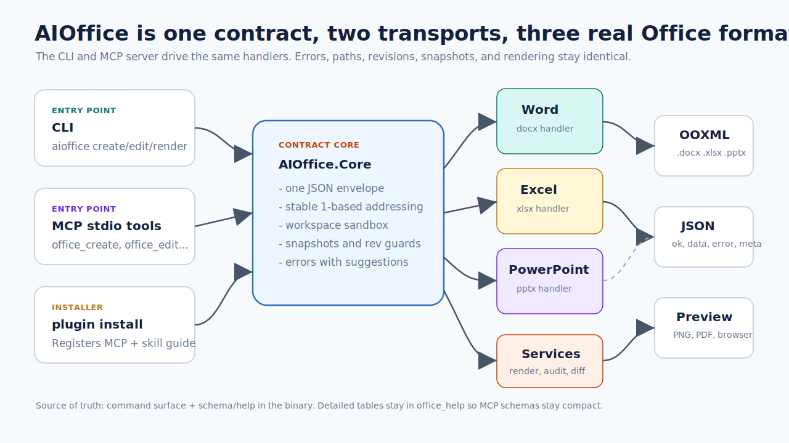
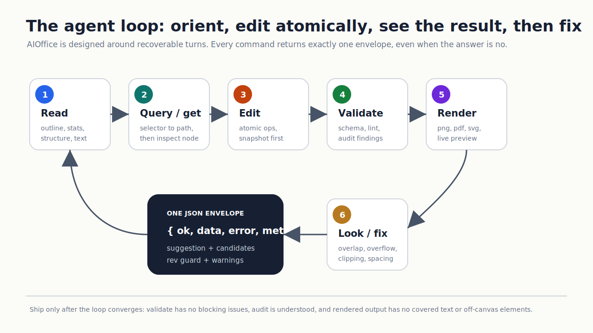
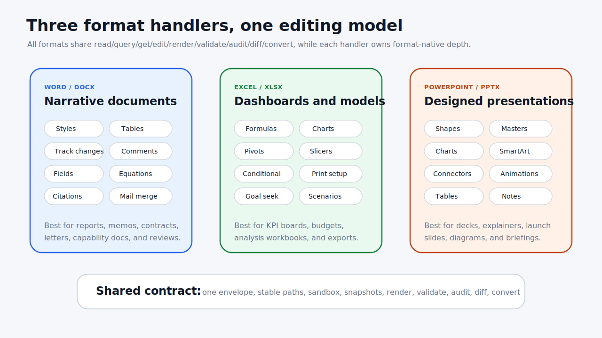
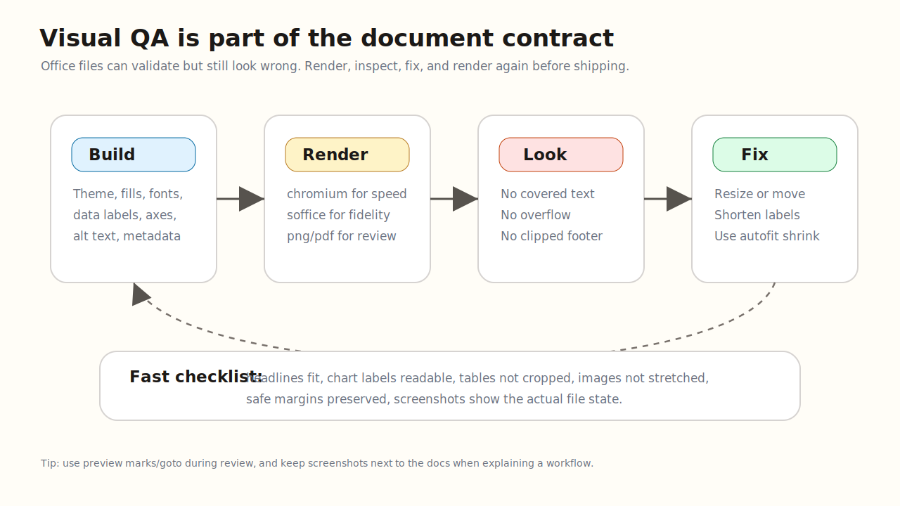

# AIOffice 文档总览

[English](README.md) | **简体中文**

AIOffice 是面向 AI agent 的 Office 执行引擎：一个自包含二进制，让 agent
创建、读取、编辑、渲染、校验、审计、对比和转换真实的 `.docx`、`.xlsx`、`.pptx`
文件。它的核心不是“又一个 Office 库”，而是一套可恢复、可自省、可视觉验收的执行面：
稳定路径、单 JSON 信封、会教学的错误、自动快照，以及 render -> look -> fix 闭环。



## 从这里读

| 你要做什么 | 读这里 |
|---|---|
| 安装二进制 | [INSTALL.md](INSTALL.md) |
| 把 agent 接入 MCP | [MCP-SETUP.md](MCP-SETUP.md) |
| 复制可运行配方 | [COOKBOOK.md](COOKBOOK.md) |
| 看真实精修产物 | [SHOWCASE.md](../SHOWCASE.md) |
| 做有设计感的 Office 交付件 | [SKILL.md](../SKILL.md) 与 [Plugin/AGENT-GUIDE.md](../src/AIOffice.Cli/Plugin/AGENT-GUIDE.md) |
| 依赖稳定 AI 命令面 | [CONTRACT.md](../CONTRACT.md) |
| 理解架构与能力对齐 | [DESIGN.md](DESIGN.md)、[MCP.md](MCP.md)、[PARITY.md](PARITY.md) |
| 了解签名/公证现状 | [SIGNING.md](SIGNING.md) |

## 它解决什么

AIOffice 通过 shell CLI 和 stdio MCP server 暴露同一套文档引擎。当前源码树里有
**19 个 CLI 动词**和 **19 个 MCP 工具**：文档契约仍保持稳定的 `surfaceVersion: "1.0"`，
新版 preview 工具与 CLI-only `plugin` 安装器负责增强周边工作流。不确定时，不要猜，
直接问二进制：

```bash
aioffice doctor
aioffice schema
aioffice help
aioffice help properties-pptx
```

面向用户和 agent 的承诺很简单：

- 每次调用只输出一个 JSON 信封：`{ ok, data, error, meta }`。
- `error.suggestion` 永远存在；路径错时返回 `candidates`。
- 元素都有规范路径，例如 `/body/p[3]`、`/Sheet1/A1:C10`、`/slide[2]/shape[@id=7]`。
- 编辑是原子批处理，写入前自动快照。
- `validate` 检查文件结构；`audit` 检查无障碍和质量问题。
- `render` 与 `preview` 把视觉检查变成 agent 工作流的一部分。



## 三种格式，同一种编辑模型

每种 Office 格式都有自己的深水区，但 agent 不需要三套工作流。它始终用同一套方式
read、query、get、edit、validate、audit、render、diff、convert。



### Word `.docx`

适合报告、备忘录、信件、合同和审阅文档。能力包括标题层级、段落/run 样式、表格、
批注、修订、内容控件、域、脚注/尾注、引用、参考文献、公式、页面设置、水印和邮件合并。

### Excel `.xlsx`

适合仪表盘、预算、数据导出和分析工作簿。能力包括单元格/区域、样式、写入即缓存的公式、
图表、透视表、切片器、条件格式、迷你图、数据验证、方案管理、单变量求解、打印设置、
相机工具快照，以及 CSV 导入导出。

### PowerPoint `.pptx`

适合演示文稿、图解、发布会幻灯片和 briefing。能力包括定位形状、图片、表格、原生图表、
公式、SmartArt、连接线、组合、母版/版式、备注、章节、切换、动画、嵌入字体、动作按钮、
媒体、3D 模型占位和 slide/section zoom。

## 视觉验收闭环

校验通过只能证明 OOXML 结构没坏，不能证明页面真的好看。凡是用户会看的文档，都要做视觉闭环：

```bash
aioffice render deck.pptx --to png --scope /slide[3] -o slide-3.png
aioffice render report.docx --to pdf --engine auto -o report.pdf
aioffice audit report.docx
aioffice validate report.docx
```



交付前检查渲染结果：

- 没有文字被其他元素遮盖。
- 标签、页脚、表格、图片、图表没有溢出容器或画布。
- 标题和按钮文字放得下。
- 图表标签、图例、坐标轴、数据标签可读。
- 截图来自最终文件，而不是旧的中间版本。

快速迭代用 Chromium 渲染。需要更接近真实 Office 的效果时，在安装了 LibreOffice 和
Poppler 的机器上用 `--engine soffice` 或 `--engine auto`。`aioffice doctor` 会在
`renderers` 里报告可用渲染器。

## 真实产物证明

这些文件直接提交在仓库中，由 AIOffice 命令生成，不是手工打开 Office 修出来的。

| 幻灯片 | 仪表盘 | 报告 |
|---|---|---|
|  |  |  |
| [SHOWCASE deck](../SHOWCASE.md#1--a-product-pitch-deck--deckpptx) | [SHOWCASE dashboard](../SHOWCASE.md#2--a-regional-revenue-dashboard--dashboardxlsx) | [SHOWCASE report](../SHOWCASE.md#3--a-capability-report--reportdocx) |

本地重建整个 gallery：

```bash
./examples/tour.sh
```

脚本会创建真实 `.pptx`、`.xlsx`、`.docx` 文件，校验它们，再渲染出 showcase 使用的 PNG。

## Agent 应该怎么跑

好的 agent 不猜。它先读文件，定位规范路径，批量编辑，然后同时验证结构和视觉：

```bash
aioffice read  report.docx --view outline
aioffice query report.docx "p[style=Heading1]"
aioffice get   report.docx /body/p[3]
aioffice edit  report.docx --ops @ops.json --expect-rev <rev>
aioffice validate report.docx
aioffice render report.docx --to png -o report.png
```

做视觉文档前，先加载设计属性词表：

```bash
aioffice help chart-polish
aioffice help themes
aioffice help masters
aioffice help properties-pptx
aioffice help properties-xlsx
aioffice help properties-docx
```

设计指南有意严格：不要交付默认白底幻灯片、裸图表、未样式化表格，或者从未渲染查看过的文本框。

## 真正的权威来源

仓库里有多层文档：

- [CONTRACT.md](../CONTRACT.md) 是稳定的 AI 命令面契约。
- `aioffice schema` 是机器可读的实时命令面。
- `aioffice help <topic>` 是运行时属性与语法参考。
- [docs/MCP.md](MCP.md) 解释 MCP 语义和传输细节。
- [CHANGELOG.md](../CHANGELOG.md) 记录增量版本。
- [docs/DESIGN.md](DESIGN.md) 记录设计与实现决策。

如果 prose 文档和二进制行为不一致，先相信二进制，再修文档。
